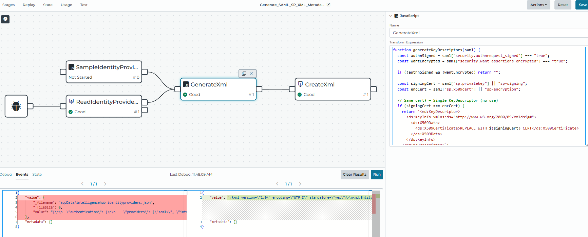
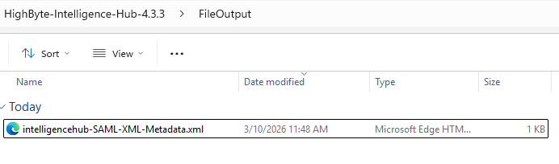

# Generate SAML SP XML Metadata

## Intelligence Hub does not natively generate SAML SP XML metadata. Use this pipeline to produce the metadata file your IT team needs when configuring an external Identity Provider (IdP) for SAML 2.0 SSO.

### Downloads

- [Pipeline import](intelligencehub-configuration.json) — the pipeline to import into Intelligence Hub
- [Sample identity providers config](sample/sample_intelligencehub-identityproviders.json) — an example of the input configuration file
- [Sample XML metadata output](sample/sample_XML_export.xml) — an example of the generated SAML SP XML metadata file

---

### Background: Why Is This Needed?

When setting up SAML 2.0 Single Sign-On (SSO), there are two parties:

- **Identity Provider (IdP)** — the system that authenticates users (e.g., Okta, Azure AD, Active Directory Federation Services)
- **Service Provider (SP)** — the application users are trying to access (in this case, Intelligence Hub)

To establish trust between them, the IdP needs to know details about the SP — specifically, the SP's entity ID, assertion consumer service (ACS) URL, and public signing certificate. This information is exchanged as an **SP XML metadata file**, the standard format defined by the SAML 2.0 specification.

Since Intelligence Hub does not expose a metadata endpoint or generate this file automatically, this pipeline reads the relevant configuration from disk and produces the XML metadata on demand.

---

### Prerequisites

Before running the pipeline, confirm the following:

- Intelligence Hub is installed and SAML has been configured in the identity providers settings
- The file `appData/intelligencehub-identityproviders.json` exists and contains your SAML configuration. See the [sample identity providers config](sample/sample_intelligencehub-identityproviders.json) for reference.
- You have access to import and run pipelines in Intelligence Hub

---

### Setup

#### Import the Pipeline

1. Download the [pipeline import file](intelligencehub-configuration.json)
2. In Intelligence Hub, navigate to **Pipelines**
3. Select **Import** and choose the downloaded file
4. Once imported, the pipeline will appear in your pipeline list

#### File Paths

| File | Path | Description |
|------|------|-------------|
| Input | `../appData/intelligencehub-identityproviders.json` | Your existing SAML identity provider configuration |
| Output | `../appData/FileOutput/intelligencehub-SAML-XML-Metadata.xml` | The generated SAML SP XML metadata file |

> **Note:** The `FileOutput` directory will be created automatically if it does not already exist.

---

### Running the Pipeline

#### Step 1: Execute the Pipeline

Run **Debug** (also called **Test Write**) to execute the pipeline.



> **Tip:** Use Debug mode for initial testing. This executes all pipeline stages and writes the output file without requiring a scheduled trigger.

#### Step 2: Verify the Output

After the pipeline completes, confirm the output file was created at:

```
/appData/FileOutput/intelligencehub-SAML-XML-Metadata.xml
```



---

### Providing the Metadata to IT

Once generated, share the `intelligencehub-SAML-XML-Metadata.xml` file with your IT or Identity team. They will use it to register Intelligence Hub as a trusted Service Provider in your IdP (e.g., upload it during SAML app setup in Okta or Azure AD). See the [sample XML metadata output](sample/sample_XML_export.xml) for an example of what this file contains.

The XML file contains the following information your IdP needs:

- **Entity ID** — the unique identifier for Intelligence Hub as a SP
- **Assertion Consumer Service (ACS) URL** — where the IdP sends the SAML response after authentication
- **Public certificate** — used by the IdP to verify signed SAML requests from Intelligence Hub

---

### Troubleshooting

**The pipeline fails to find the input file**
Confirm that `intelligencehub-identityproviders.json` exists at `../appData/`. SAML must be configured in Intelligence Hub before this file is populated with the necessary values.

**The output directory does not exist**
The pipeline should create `FileOutput` automatically. If it does not, manually create the folder at `../appData/FileOutput/` and re-run the pipeline.

**The generated XML is missing expected values**
Open `intelligencehub-identityproviders.json` and verify it contains a complete SAML configuration, including the entity ID, ACS URL, and certificate. Incomplete configuration in the source file will result in incomplete or invalid XML metadata.

**IT reports the metadata file is invalid**
Ensure the pipeline completed without errors. Re-run in Debug mode and review the pipeline output log for any stage-level errors before re-sharing the file.